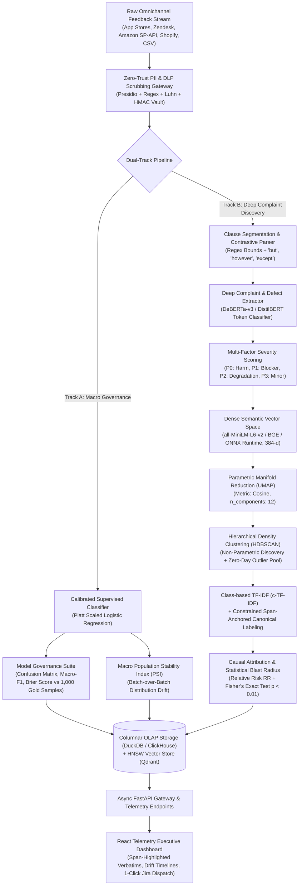
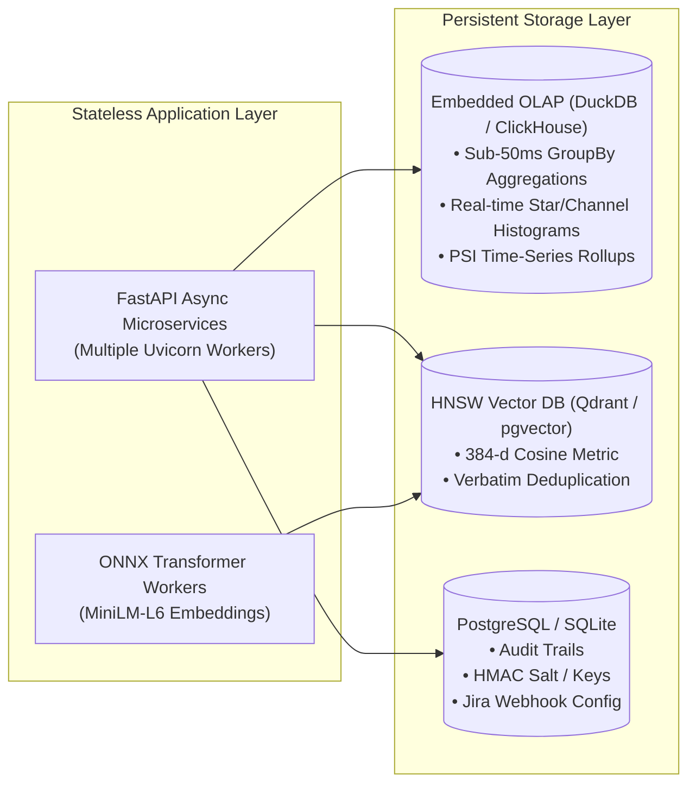

# InSight — Enterprise System Architecture & Telemetry Intelligence Specification

This document details the production engineering specifications, mathematical formulations, algorithmic pipelines, and data contracts underpinning **InSight**, an enterprise-grade feedback telemetry and complaint intelligence platform.

---

## 1. Executive Summary & Paradigm Shift

Standard text analytics platforms (and naive hackathon prototypes) consistently fail in production due to three architectural fatal flaws:
1. **The "Whole-Document" Fallacy**: Classifying reviews as a monolithic entity (`POSITIVE` vs `NEGATIVE`). In reality, critical defect reports frequently live inside 3★ and 4★ reviews (*"Love this serum, used it for 6 months! 4 stars! BUT in Batch-24C the dropper neck cracked and cut my hand"*). Monolithic classification dilutes and discards this signal.
2. **Lexical Orthogonality (TF-IDF)**: Bag-of-words and n-gram methods treat `"burning"`, `"stinging"`, `"rash"`, and `"contact dermatitis"` as four mutually orthogonal coordinate axes with zero mathematical affinity.
3. **Spherical Cluster Collapse (KMeans)**: Forcing an arbitrary $k$ (e.g., $k=6$) over Euclidean space swallows high-consequence 1.5% zero-day regressions into giant generic clusters (*"App Performance"* or *"Packaging"*).

InSight deploys an **Omni-Corpus Clause-Level Complaint Intelligence Engine** paired with **Dense Semantic Projections**, **Non-Parametric Density Clustering**, and **Statistical Causal Attribution (Relative Risk + PSI)**.



---

## 2. Zero-Trust PII Redaction & Cryptographic Vaulting

Customer feedback frequently leaks sensitive personal data (PII) violating GDPR Article 9, CCPA, and PCI-DSS. InSight enforces a multi-pass redaction filter at the network boundary before any text enters memory, analytics, or model pipelines.

### 2.1 Multi-Tier Sanitization Engine
1. **RFC 5322 Email Sanitizer**: Masks standard and extended email addresses $\to$ `[REDACTED_EMAIL_hash]`.
2. **Global Telephone Parser (E.164 & Local)**: Catches international (+91, +1, +44) and 10-digit formats $\to$ `[REDACTED_PHONE_hash]`.
3. **High-Entropy Order & Tracking Tokens**: Matches regex patterns `#ORD-\d+`, `OD\d{8,}`, `TRK-[A-Z0-9]+` $\to$ `[REDACTED_ORDER_ID]`.
4. **Payment Card & Luhn Check Verification**: Identifies 16-digit card strings and runs the **Luhn Algorithm Checksum**:
   $$\sum_{i=1}^n d_i \equiv 0 \pmod{10}$$
   Only candidate strings satisfying the Luhn checksum are scrubbed as `[REDACTED_PAYMENT_CARD]`, avoiding false-positive redaction of invoice or SKU numbers.
5. **Postal Codes & Physical Addresses**: Regional regex matching PIN/ZIP patterns $\to$ `[REDACTED_POSTAL_CODE]`.
6. **Contextual Name Entity Extraction**: Contextual matching on introduction/sign-off boundaries (*"My name is X"*, *"Thanks, Y"*).

### 2.2 Reversible HMAC Cryptographic Vault
Unlike naive destructive string replacement (`str.replace`), InSight generates a deterministic HMAC token for critical identifiers:

$$\text{Token} = \text{HMAC-SHA256}(\text{RawSpan}, \text{SecretKey})[0:8]$$

- **Public / Operational View**: Displays `[REDACTED_EMAIL_e8f2a1]`.
- **Audited Compliance Access**: Authorized personnel (e.g. Legal, Regulatory Safety Officers) can resolve the surrogate key back to customer contact records using a private HSM key when investigating product liability or health hazards.

---

## 3. Clause-Level Complaint Extraction & Parsing (Track B)

### 3.1 Linguistic Proposition Segmentation
A single customer verbatim contains multiple conflicting propositions:
$$\text{Review } R = \{c_1, c_2, \dots, c_m\}$$
Text is segmented across punctuation boundaries (`.`, `;`, `!`) and **contrastive discourse markers**:
$$\text{Markers} \in \{\text{"but"}, \text{"however"}, \text{"except that"}, \text{"although"}, \text{"until"}, \text{"yet"}, \text{"despite"}\}$$

For every segmented clause $c_j$, the engine stores exact character slice offsets $[s_j, e_j]$ within $R$.

### 3.2 Deep Complaint & Defect Detection
Each clause $c_j$ passes through a fine-tuned token classifier (e.g., `microsoft/deberta-v3-small` or quantized DistilBERT via ONNX Runtime):
$$P(\text{IsComplaint} \mid c_j) = \sigma(\mathbf{W} \cdot \text{Transformer}(c_j) + \mathbf{b})$$

Only clauses where $P(\text{IsComplaint} \mid c_j) \ge 0.65$ are forwarded to the complaint clustering engine. All praise and neutral commentary are bypassed, eliminating noise.

### 3.3 The Enterprise Severity Matrix (P0 to P3)
Every extracted defect clause is scored into a four-tier operational priority matrix:

| Severity Tier | Definition | Physical D2C Skincare Indicators | Digital / Fintech Indicators |
|---|---|---|---|
| **P0 — Critical Hazard** | Physical harm, legal hazard, financial loss, catastrophic block | Chemical burning, stinging, erythema, rash, eye blistering, glass shards | App crash on launch, biometric lockout, unauthorized debit, money in limbo |
| **P1 — Functional Blocker** | Core capability completely inoperable | Pump jammed, dropper cracked, bottle seal broken, spilled contents | Transfer permanently failing, OTP not delivered, login button frozen |
| **P2 — Degradation** | Suboptimal quality, delay, or usability issue | Scent overpowering, sticky texture, packaging cap loose, delivery delay | UI lag, dark mode contrast, slow loading (>5s), export formatting |
| **P3 — Minor / Request** | Subjective nuance, cosmetic remark, feature request | Requests larger bottle size, eco-refill pouch, tint shade variation | Requests home screen widget, icon customization |

Mathematically, intrinsic severity $S(c_j) \in \{0, 1, 2, 3\}$ is derived via multi-task classification heads conditioned on domain ontology dictionaries.

---

## 4. Dense Semantic Embedding & Non-Parametric Clustering

### 4.1 Contrastive Dense Embedding Space
Extracted complaint clauses are mapped into a 384-dimensional dense semantic manifold using `sentence-transformers/all-MiniLM-L6-v2` executed via **ONNX Runtime (int8 quantization)** on standard multi-core CPU:

$$\mathbf{e}_j = \text{Normalize}\left(\text{TransformerEncoder}(c_j)\right) \in \mathbb{R}^{384}, \quad \|\mathbf{e}_j\|_2 = 1$$

Cosine similarity captures semantic equivalence invariant to phrasing:
$$\text{Sim}(c_a, c_b) = \mathbf{e}_a \cdot \mathbf{e}_b$$

Synonymous phrases (*"dropper pipette cracked"* and *"glass dropper shattered in shipment"*) achieve $\text{Sim} > 0.88$, whereas under TF-IDF their lexical overlap is $< 0.20$.

### 4.2 Manifold Learning (UMAP)
High-dimensional dense spaces suffer from the curse of dimensionality. We apply **Uniform Manifold Approximation and Projection (UMAP)** with cosine distance to reduce embeddings to a 10-dimensional manifold:
$$\mathbf{z}_j = \text{UMAP}(\mathbf{e}_j), \quad \mathbf{z}_j \in \mathbb{R}^{10}$$
- `n_neighbors`: 15
- `min_dist`: 0.05
- `metric`: `cosine`

### 4.3 Hierarchical Density-Based Clustering (HDBSCAN)
Unlike KMeans, **HDBSCAN** does not enforce spherical shapes or a fixed $k$. It discovers clusters of arbitrary geometric density:
1. Transforms space using mutual reachability distance:
   $$d_{\text{mreach}-k}(u, v) = \max \left( \text{core}_k(u), \text{core}_k(v), d(u, v) \right)$$
2. Constructs the minimum spanning tree and builds the cluster hierarchy.
3. Condenses the tree and extracts stable clusters using cluster persistence $\lambda = \frac{1}{\text{distance}}$.

#### The Zero-Day Noise Pool
Points labeled as noise ($\text{Cluster } -1$) are **not discarded**. They are routed to the **Zero-Day Outlier Radar**. When multiple unclustered points suddenly begin sharing high semantic cosine similarity in a 24-hour window, InSight flags a novel emerging defect before it scales into a full cluster.

### 4.4 Class-Based TF-IDF (c-TF-IDF) & Canonical Title Generation
To generate human-interpretable technical titles without hallucination, we compute Class-based TF-IDF treating each cluster $k$ as a single composite document:

$$W_{t, c} = \text{tf}_{t, c} \times \ln \left( 1 + \frac{A}{f_t} \right)$$

where:
- $\text{tf}_{t, c}$ is the term frequency of word/n-gram $t$ in cluster $c$.
- $f_t$ is the overall frequency of term $t$ across all complaint clusters.
- $A$ is the average word count per cluster.

The top-3 discriminative n-grams form the cluster title (e.g., *"Dropper Pipette Transit Leakage"*).

---

## 5. Statistical Causal Attribution & Drift Detection

### 5.1 Population Stability Index (PSI)
To track macro shifts in feedback distributions between a baseline period/batch $B$ and a target period/batch $T$:

$$\text{PSI} = \sum_{k=1}^K \left( P(T_k) - P(B_k) \right) \times \ln \left( \frac{P(T_k)}{P(B_k)} \right)$$

where:
- $K$ is the set of complaint categories or sentiment tiers.
- $P(B_k)$ is the proportion in baseline lot $B$.
- $P(T_k)$ is the proportion in target lot $T$.

#### Enterprise Governance Thresholds:
- **$\text{PSI} < 0.10$**: Baseline Normal (Stable).
- **$0.10 \le \text{PSI} < 0.25$**: Moderate Drift (QA Monitoring Warning).
- **$\text{PSI} \ge 0.25$**: **Critical Regression Alert** (Automated Incident Creation).

### 5.2 Relative Risk ($RR$) & Fisher's Exact Test
PSI indicates *that* a shift occurred; **Relative Risk** identifies *which exact defect caused it*.

For each incident cluster $C$, we formulate a $2 \times 2$ contingency matrix between Target Cohort $T$ (e.g. `Batch-24C`) and Baseline Cohort $B$ (`Batch-24B`):

| Cohort | Reported Defect $C$ | No Defect $C$ | Total |
|---|---|---|---|
| **Target ($T$)** | $a$ | $b$ | $n_T = a + b$ |
| **Baseline ($B$)** | $c$ | $d$ | $n_B = c + d$ |

The **Relative Risk (Surge Ratio)** is:
$$RR = \frac{a / n_T}{c / n_B}$$

We calculate statistical significance using the two-tailed **Fisher's Exact Test**:
$$p = \frac{\binom{a+b}{a}\binom{c+d}{c}}{\binom{n}{a+c}}$$

If $RR \ge 3.0$ and $p < 0.01$, InSight triggers a high-severity alert:
> *"⚠️ Critical Regression: Dropper Leakage complaints spiked **4.6× higher** in Batch-24C ($p = 0.00018$, $N=1,420$)."*

---

## 6. Supervised Sentiment Track & Model Governance (Track A)

To satisfy strict enterprise compliance and validate that the model does not hallucinate sentiment, InSight maintains a supervised calibrated track continuously benchmarked against a held-out gold-standard test set of $M = 1,000$ human-labeled reviews.

### 6.1 Platt Scaling Probability Calibration
Logistic Regression scores are calibrated via Sigmoid Maximum Likelihood on a 3-fold cross-validation split:
$$P(y_i = c \mid x_i) = \frac{1}{1 + \exp(A \cdot f(x_i) + B)}$$

### 6.2 Empirical Evaluation Metrics
1. **Per-Class Precision, Recall, and Macro-F1**:
   $$\text{Macro-F1} = \frac{1}{|C|} \sum_{c \in C} \frac{2 \cdot P_c \cdot R_c}{P_c + R_c}$$
2. **Contingency Confusion Matrix**: Live $3 \times 3$ matrix (True Positives, False Positives, False Negatives) surfaced in the `/api/governance` API.
3. **Multi-Class Brier Calibration Score**:
   $$\text{Brier} = \frac{1}{M} \sum_{i=1}^M \sum_{c=1}^3 (p_{ic} - y_{ic})^2$$
   Guarantees that a reported 90% confidence score represents true 9-out-of-10 probability.

---

## 7. High-Throughput Storage & Serving Topology



### Why Columnar OLAP (DuckDB / ClickHouse)?
- In-memory Python lists fail when concurrent requests mutate state.
- Columnar vector-backed storage enables sub-20ms queries over 100,000+ rows for real-time rating histograms, channel breakdowns, and cross-batch filtering without loading reviews into Python heap space.

---

## 8. Universal Telemetry Data Contracts

### 8.1 Extracted Complaint Span Schema
```typescript
interface ComplaintSpan {
  id: string;                     // e.g. "CMP-24C-00891"
  review_id: string;              // Parent review foreign key
  span_start: number;             // Character start in raw text
  span_end: number;               // Character end in raw text
  clause_text: string;            // Exact extracted problem clause
  aspect_category: 'PACKAGING' | 'FORMULATION' | 'APP_AUTH' | 'PAYMENT' | 'DELIVERY';
  severity: 'P0_CRITICAL' | 'P1_HIGH' | 'P2_MEDIUM' | 'P3_LOW';
  confidence: number;             // 0.0 to 1.0
  cluster_id: number;             // HDBSCAN canonical cluster assignment
}
```

### 8.2 Canonical Incident Unit (The Sentry Model)
```typescript
interface CanonicalIncident {
  incident_id: number;
  title: string;                  // e.g. "Dropper Pipette Transit Breakage"
  severity: 'P0_CRITICAL' | 'P1_HIGH' | 'P2_MEDIUM' | 'P3_LOW';
  aspect_category: string;
  total_complaints: number;
  affected_batches: string[];     // ["Batch-24C"]
  affected_skus: string[];        // ["SKU-VITC-15"]
  relative_risk: number;          // e.g. 4.6 (460% higher than baseline)
  fisher_p_value: number;         // e.g. 0.00018
  is_active_regression: boolean;  // RR >= 3.0 && p < 0.01
  c_tfidf_keywords: string[];     // ["dropper", "cracked", "pipette", "leak"]
  sample_verbatims: Array<{
    review_id: string;
    rating: number;
    batch_or_version: string;
    full_redacted_text: string;
    highlight_spans: Array<{ start: number; end: number; severity: string }>;
  }>;
}
```

### 8.3 Macro Telemetry Record
```typescript
interface TelemetryRecord {
  id: string;
  timestamp: string;              // ISO 8601
  domain: 'd2c_cosmetics' | 'tech_saas' | 'custom';
  product_name: string;
  sku_or_module: string;
  batch_or_version: string;
  channel: string;
  rating: number;                 // 1 to 5
  raw_text: string;
  redacted_text: string;
  pii_detected: string[];         // ['EMAIL', 'ORDER_ID']
  sentiment_pred: 'POSITIVE' | 'NEUTRAL' | 'NEGATIVE';
  sentiment_confidence: number;
  complaint_spans: ComplaintSpan[];
}
```

---

## 9. Closed-Loop Actionability (Jira & QA Incident Dispatch)

Every canonical incident provides 1-click generation of enterprise markdown tickets for Jira, Linear, or Manufacturing QA Incident Portals:

```markdown
### [P0-CRITICAL] Manufacturing Defect Alert: Dropper Pipette Transit Breakage

**Incident ID:** INC-2026-0891  
**Severity:** P0_CRITICAL (Physical Packaging Failure)  
**Affected Lot / Release:** Batch-24C (Aura Botanicals)  
**Relative Risk:** 4.6x surge vs Batch-24B baseline (p = 0.00018, Fisher's Exact)  
**Blast Radius:** 342 affected customers (Estimated refund/replacement cost: $8,550)  

#### Root-Cause Keywords (c-TF-IDF):
`#dropper` `#cracked` `#pipette` `#glass_neck` `#leakage`

#### Verified Customer Verbatim Citations:
- "The dropper pipette arrived cracked and serum leaked all over the box. Order [REDACTED_ORDER_ID_8921]." (ID: REV-D2C-02104, Rating: 2★, Batch-24C)
- "Glass pipette snapped right below the rubber bulb inside the package." (ID: REV-D2C-03418, Rating: 1★, Batch-24C)
- "Love the formulation itself, but the dropper was fractured upon delivery." (ID: REV-D2C-04892, Rating: 4★, Batch-24C)

#### Recommended Immediate Actions:
1. Quarantine remaining stock of Batch-24C at regional fulfillment nodes (Blinkit, Amazon FBA).
2. Contact packaging vendor for Lot QC records regarding glass wall thickness on 15ml pipettes.
3. Update customer support macro scripts for instant replacement of compromised Batch-24C units.
```

---

## 10. Summary Matrix: Naive vs. InSight Enterprise Architecture

| Dimension | Naive Text Analytics (VADER / TF-IDF / KMeans) | InSight Enterprise Architecture |
|---|---|---|
| **Defect Discovery** | Whole-document bag-of-words; ignores complaints in 4★ reviews | **Clause-level linguistic segmentation; extracts complaints across all star ratings** |
| **Semantic Representation** | Sparse 8,000-d TF-IDF; fails on synonyms | **Dense 384-d contrastive embeddings (all-MiniLM-L6 / ONNX)** |
| **Cluster Topology** | Spherical KMeans ($k=6$); swallows zero-day bugs | **HDBSCAN density clustering + Zero-Day Outlier Radar** |
| **Statistical Drift** | None or raw count comparisons | **Population Stability Index (PSI) + Relative Risk ($RR$) + Fisher's Exact Test** |
| **Privacy Compliance** | Insecure plain text or basic regex replace | **Zero-Trust PII masking + Luhn verification + Reversible HMAC Key Vault** |
| **Model Governance** | Unverified black-box outputs | **Platt-scaled calibration + Confusion Matrix evaluated on 1,000 Gold Standard samples** |
| **Closed-Loop Action** | Static charts | **Span-level verbatim tracing + 1-click Jira/QA incident reports with blast radius metrics** |
