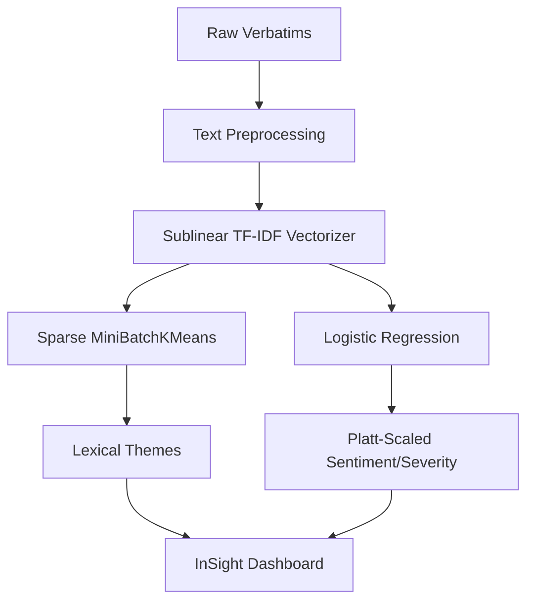
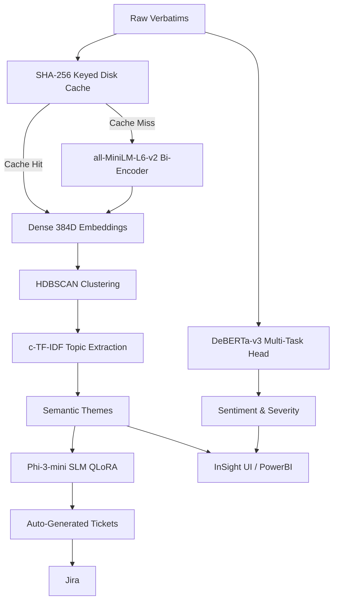
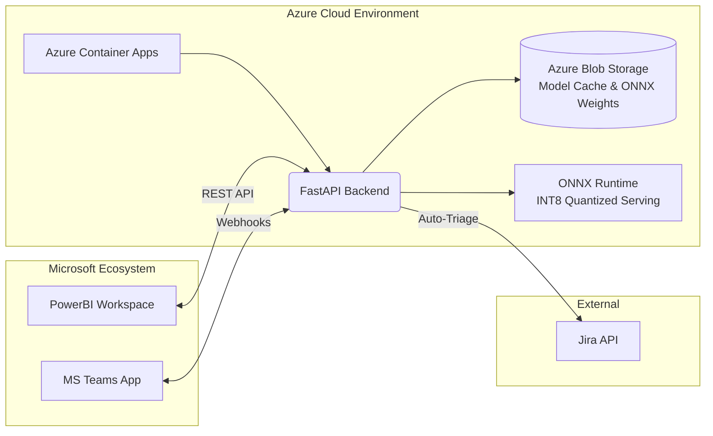

# InSight ML Engine: Architecture Evolution

## Executive Summary
This document outlines the evolutionary architecture of the InSight ML engine. Rather than over-engineering from day one, the system was built in two distinct phases: 
1. **v1 (The Classical MVP)**: A lightweight, ultra-low latency baseline designed to prove the core concept.
2. **v2 (The Neural Engine)**: A state-of-the-art transformer and SLM-based architecture designed to solve the semantic limitations of v1 and automate complex reasoning tasks.

---

## Phase 1: InSight v1 (The Classical MVP)

The initial architecture was built for speed, simplicity, and establishing a robust baseline.

### Core Pipeline
* **Text Representation:** Sublinear TF-IDF. Maps verbatims to sparse high-dimensional vectors based on exact token frequencies.
* **Clustering & Topic Modeling:** Sparse MiniBatchKMeans. Groups similar TF-IDF vectors into themes.
* **Classification (Sentiment/Severity):** Logistic Regression with Platt Scaling for calibrated confidence scores.

### Strengths
* **Ultra-Low Latency:** Inference times in the sub-millisecond range (<0.5ms).
* **Zero Neural Dependencies:** No GPU required, minimal memory footprint, trivial deployment.
* **Highly Interpretable:** Easy to map feature weights back to specific words.

### The Bottleneck: Lexical Mismatch
While v1 was fast, it fundamentally lacked semantic understanding. It relied on exact word overlaps. For example, "The app crashed" and "Software closed unexpectedly" would be mapped far apart in the vector space, despite meaning the same thing. To capture true user intent, we needed dense semantic representations.

---

## Phase 2: InSight v2 (The Neural Engine)

To address the lexical mismatch and enable deeper automated reasoning (like generating Jira tickets), we migrated the core engine to a dense, transformer-based architecture.

### Core Pipeline

#### 1. Semantic Clustering (Theme Extraction)
* **Dense Embedding:** `all-MiniLM-L6-v2` Bi-Encoder. Converts text into 384-dimensional dense vectors, capturing semantic meaning rather than just keywords.
* **Topic Representation:** `c-TF-IDF` (Class-based TF-IDF). After clustering dense vectors, c-TF-IDF extracts the most representative keywords for each cluster, combining the semantic power of transformers with the interpretability of classical methods.

#### 2. Multi-Task Classification
* **Model:** `DeBERTa-v3`.
* **Approach:** Replaced isolated Logistic Regression models with a single Multi-Task Learning (MTL) DeBERTa head. It predicts sentiment and severity simultaneously, allowing the model to learn shared representations (e.g., severe issues are often highly negative).
* **Calibration:** Maintained Platt calibration on top of the logits to ensure probability outputs remain trustworthy.

#### 3. Generative Synthesis (Auto-Triage)
* **Model:** `Phi-3-mini` (Small Language Model).
* **Approach:** Parameter-Efficient Fine-Tuning (PEFT) via QLoRA. The model synthesizes clusters of negative verbatims into structured, actionable Jira bug reports or feature requests.

### Engineering Optimizations for v2
Moving to transformers introduces significant latency and compute overhead. We implemented several backend optimizations to keep the API snappy:
* **Lazy Loading & Disk Caching:** Dense embeddings for large datasets take time to compute on CPU (~35s for 10k rows). We implemented a SHA-256 keyed `.npy` disk caching layer. The backend lazily initializes domains (`ensure_initialized()`), instantly loading pre-computed embeddings from disk.
* **Quantized Serving:** Moving inference to ONNX INT8 to drastically reduce latency and memory usage, allowing the v2 engine to run efficiently without requiring expensive GPU instances for serving.

---

## v1 vs v2 Comparison

| Feature | v1: Classical MVP | v2: Neural Engine |
| :--- | :--- | :--- |
| **Representations** | Sparse (TF-IDF) | Dense (`all-MiniLM-L6-v2`) |
| **Clustering** | MiniBatchKMeans | HDBSCAN over Dense Vectors |
| **Classification** | Independent Logistic Regression | Multi-task `DeBERTa-v3` |
| **Synthesis** | N/A | `Phi-3` QLoRA |
| **Compute Req.** | CPU only | CPU (Optimized) / GPU (Preferred) |
| **Cold Start** | Instant | Instant (via SHA-256 caching) |

## Architecture Diagrams

### 1. Phase 1: v1 Classical MVP

### 2. Phase 2: v2 Neural Engine

### 3. Microsoft Environment Integration & Deployment

## Conclusion
The transition from v1 to v2 represents a shift from *keyword matching* to *semantic understanding*. By establishing v1 first, we secured a reliable baseline and proved the UX. The v2 architecture brings state-of-the-art NLP to the application, unlocking automated ticket generation and nuanced theme extraction, while our engineering optimizations (caching, lazy-loading) ensure the UX remains fast.
