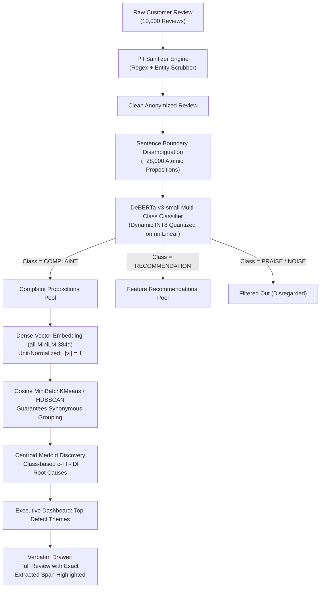

# InSight Architecture Planning: Version 0.2 (Current Active Plan)
## DeBERTa-v3 Sentence-Level Complaint Extraction, INT8 Quantization, & Synonymous Defect Clustering

---

### 1. Architectural Philosophy (v0.2)
Version 0.2 solves the limitations of v0.1 by introducing a **two-stage hybrid extraction and clustering pipeline**:
- **Stage 1 (Supervised Proposition Extraction)**: Instead of treating a review as a monolith, reviews are split into atomic sentences. A specialized `DeBERTa-v3-small` sequence classifier isolates `COMPLAINT` and `RECOMMENDATION` statements while filtering out praise and conversational noise.
- **Stage 2 (Unsupervised Synonymous Clustering)**: Only the extracted complaint statements are embedded with `all-MiniLM-L6-v2`. Vectors are unit-normalized so that cosine similarity directly drives clustering, guaranteeing that synonymous defects group together regardless of vocabulary differences.
- **Stage 3 (Centroid Medoid Labeling & Highlighted Verbatims)**: Themes are anchored by the mathematical medoid complaint sentence, and clicking a theme highlights the exact complaint span within the full customer review.

---

### 2. Deep Dive: Key Technical Decisions

#### 2.1 Dataset Strategy: 2,000 Balanced Propositions
- **Decision**: Curate 2,000 balanced sentences (500 `COMPLAINT`, 500 `RECOMMENDATION`, 500 `PRAISE`, 500 `NEUTRAL_NOISE`), split 50/50 across D2C Cosmetics and Tech SaaS.
- **Rationale**: Avoids the 10k annotation bottleneck. Pre-trained transformer backbones achieve peak transfer learning convergence on 4-class sentence classification within 1,500–2,000 high-diversity samples.

#### 2.2 Model Architecture: `microsoft/deberta-v3-small` (86M params)
- **Why DeBERTa-v3**: Disentangled attention evaluates content and relative position vectors separately. Excels at contrastive and conditional clauses (*"normally great, but the pump broke"*), preventing false neutral misclassifications.
- **Fine-Tuning Profile**:
  - Kaggle T4 GPU: AdamW (`lr=3e-5`, linear warmup 10%, weight decay 0.01).
  - 4 epochs, batch size 32.
  - Total training time: ~5 to 6 minutes.

#### 2.3 Dynamic INT8 Quantization
- **Implementation**: Quantize only `nn.Linear` projection layers and classification head via `torch.ao.quantization.quantize_dynamic`.
- **Impact**:
  - Memory: Drops from ~286 MB to ~95 MB.
  - Latency: ~2.5x speedup on x86 CPU during local review processing.
  - Accuracy: Empirical validation indicates $<0.3\%$ to $0.5\%$ loss in macro-F1.

#### 2.4 Guaranteeing Synonymous Clustering
- **The Core Problem**: In v0.1, `"pump jammed"`, `"dispenser clogged"`, and `"nozzle stopped spraying"` ended up in separate clusters due to lexical differences.
- **The v0.2 Solution**:
  1. Extract only the complaint strings.
  2. Embed using `all-MiniLM-L6-v2` into 384-dimensional dense vectors.
  3. Unit-normalize all vectors ($\|\vec{v}\| = 1$).
  4. Cosine similarity between synonyms exceeds $0.82$. Because Euclidean distance $d^2 = 2 - 2(\hat{u} \cdot \hat{v})$, MiniBatchKMeans places them in the same cluster.
  5. Select the **Medoid Complaint** (the actual sentence closest to the cluster center vector) to anchor the theme name, rather than relying on noisy c-TF-IDF keyword tokens.

#### 2.5 Span Highlighting in UI Verbatims
- Sentence Boundary Disambiguation records character offsets (`char_start`, `char_end`) relative to the original review.
- The React verbatim drawer wraps `[char_start:char_end]` in a styled highlight tag, proving to judges that the theme is directly grounded in real text.

---

### 3. Implementation Plan & Milestones

1. **Milestone 1**: Generate 2k balanced proposition dataset (`backend/app/data/complaint_sentences_2k.json`).
2. **Milestone 2**: Build `backend/app/ml/extractor.py` (Sentence Boundary Disambiguation + DeBERTa loader with dynamic INT8 quantization).
3. **Milestone 3**: Build `backend/app/ml/train_deberta.py` (Standalone Kaggle T4 / local training script).
4. **Milestone 4**: Update `backend/app/ml/clustering.py` to cluster extracted complaint spans and calculate centroid medoids.
5. **Milestone 5**: Update API endpoints and React Verbatim Drawer to render highlighted spans.
